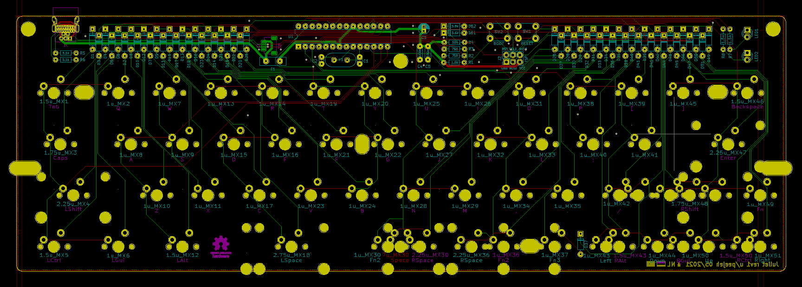
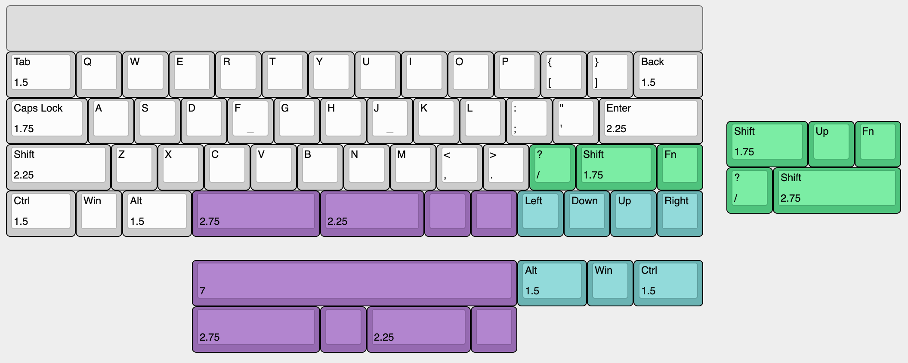

# Juliet - Through-hole staggered 40% keyboard PCB for 60% cases

Juliet is a 40% keyboard PCB using through-hole components for that visible component aesthetic.

The goal of this project is to build an all through-hole component 40% PCB that fits in a standard 60% tray mount case.

Inspired by the [Plaid](https://github.com/hsgw/plaid) and the [Romeo](https://github.com/coseyfannitutti/romeo).

* Designed to be easy to build with minimal soldering experience.
* All through-hole components, no SMD soldering required.
* Get that visible component aesthetic in a standard 60% tray-mount case.
* Supports both USB Mini and USB-C.

The layout is a number row-less 60% layout with split spacebar or 7u bottom row and split right shift. An arrow cluster layout is also supported by moving the right shift.

# Ordering parts

PCBs can be manufactuered by a variety of online PCB fabricators. You can use [PCBShopper](https://pcbshopper.com/) to search for the best price.

# Construction

Solder all the components onto the top side of the PCB except the USB connector which should be on the back of the board. Leave the larger components until last so that the board will lie flat upsidedown while you solder the resistors and capacitors.

Take care to put the correct value resistors and capacitors in the correct places, the values are written on the silkmask along with the component reference. If you are unsure about the value of a resistor, check it with a multimeter.

Ensure that polarised components (diodes, LEDs, electrolytic capacitor (C3), IC socket) are in the correct orientation. The square pad is for the negative side of the component; for a diode this means the side with the black stripe; for LEDs and C3 the short leg is the cathode and goes in the square pad.

# Firmware

TBD.

## Matrix information

If you are building your own firmware, the following matrix information will be useful to you:

| Configuration   | Value                                  |
|-----------------|----------------------------------------|
| MATRIX_ROWS     | 7                                      |
| MATRIX_COLS     | 8                                      |
| MATRIX_ROW_PINS | C0, B5, B4, B3, B2, B1, C3             |
| MATRIX_COL_PINS | B0, D7, D6, C2, D4, D1, D0, C1         |
| DIODE_DIRECTION | COL2ROW                                |

# Component cover

Cut a piece of 2mm thick acrylic to size (285x19mm) and drill 3 m2 holes for the standoffs. Use the PCB as a guide for the hole positions.

Affix the 3 standoffs to the PCB with screws from underneath the PCB. Use the remaining 3 screws to attach the acrylic to the top of the standoffs.

